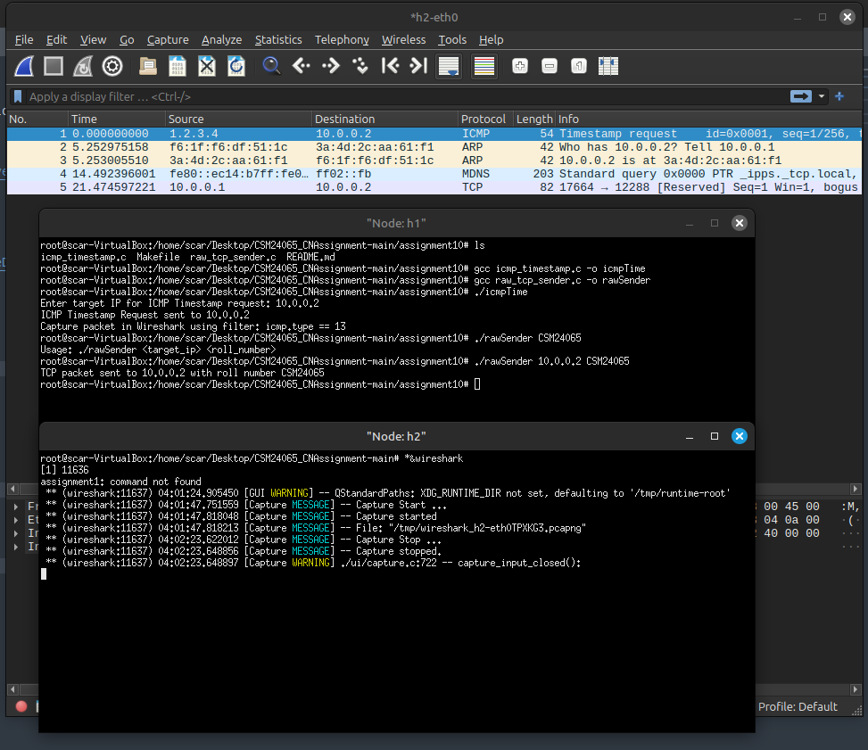

# CN Lab – Assignment 10

## Objective
Using RAW sockets to generate packets.

## Exercise
Write two C programs using raw socket to send:
1. TCP packet where TCP payload will contain your roll number
2. ICMP time stamp messages towards a target IP

## Steps/Hints
1. Use RAW socket to create your TCP packet with user given header and payload
2. Use the suitable ICMP message type to create timestamp messages
3. Receiver of the ICMP message must display the packet in wireshark

## Output Screenshots

---
`CSM24065`