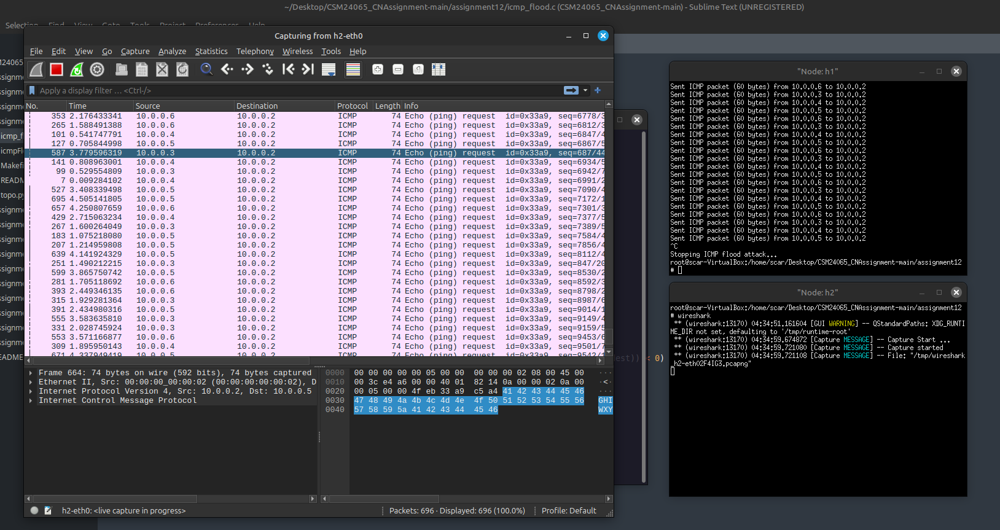

# CN Lab – Assignment 12

## Objective
Using RAW sockets to generate ICMP flooding attack.

## Exercise
Do the same attack as given in assignment no. 11 with ICMP packets using RAW socket?

## Steps/Hints
1. Use RAW socket to create your ICMP message with user given header
2. Use a total of six mininet hosts. One will be attacker, one for the victim and four as spoofed agent devices for communicating with the victim

## Output Screenshots

---
`CSM24065`