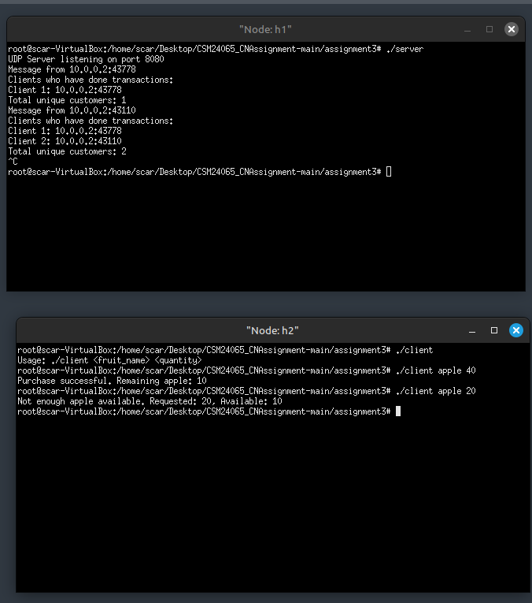

# CN Lab – Assignment 3

## Objective
To gain experience of UDP Socket Programming for simple applications.

## Exercise
Redo assignment 2 using UDP socket.

## Steps/Hints
Same as given in Assignment 1.

## Output Screenshots

---
`CSM24065`