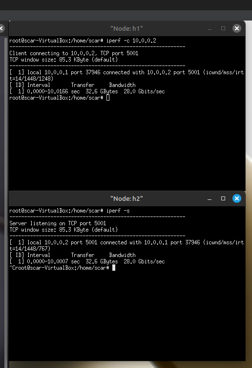

# CN Lab - Assignment 5

## Objective
To gain knowledge of more packet capturing tools.

## Exercise
Learn and use maximum number of packet generation tools.

## Steps to Perform the Exercise

1. Install Iperf in your Mininet environment:
   ```bash
   sudo apt-get update
   sudo apt-get install iperf
   ```

2. Install D-ITG (Direct Internet Traffic Generator):
   ```bash
   # Download D-ITG from SourceForge
   wget https://sourceforge.net/projects/ditg/files/D-ITG-2.8.1-r1023-src.zip
   unzip D-ITG-2.8.1-r1023-src.zip
   cd D-ITG-2.8.1-r1023/src
   make
   sudo make install
   ```

3. Using Iperf for TCP traffic generation:
   - Start iperf server on one host:
     ```bash
     iperf -s
     ```
   - Generate TCP traffic from another host:
     ```bash
     iperf -c <server_ip> -t 10
     ```

4. Using Iperf for UDP traffic generation:
   - Start iperf server on one host:
     ```bash
     iperf -s -u
     ```
   - Generate UDP traffic from another host:
     ```bash
     iperf -c <server_ip> -u -b 1M
     ```

5. Using D-ITG for traffic generation:
   - Start D-ITG receiver on one host:
     ```bash
     ITGRecv
     ```
   - Generate traffic from another host:
     ```bash
     ITGSend -a <receiver_ip> -T UDP -c 100 -C 10 -t 10000
     ```

6. Other packet generation tools:
   - hping3: Advanced TCP/IP packet assembler/analyzer
   - tcpreplay: Replay network traffic stored in pcap files
   - netperf: Network performance measurement
   - nuttcp: Network performance measurement tool

## Learning Outcomes
1. Knowledge of packet generation and capturing tools.

## Output Screenshots



CSM24065