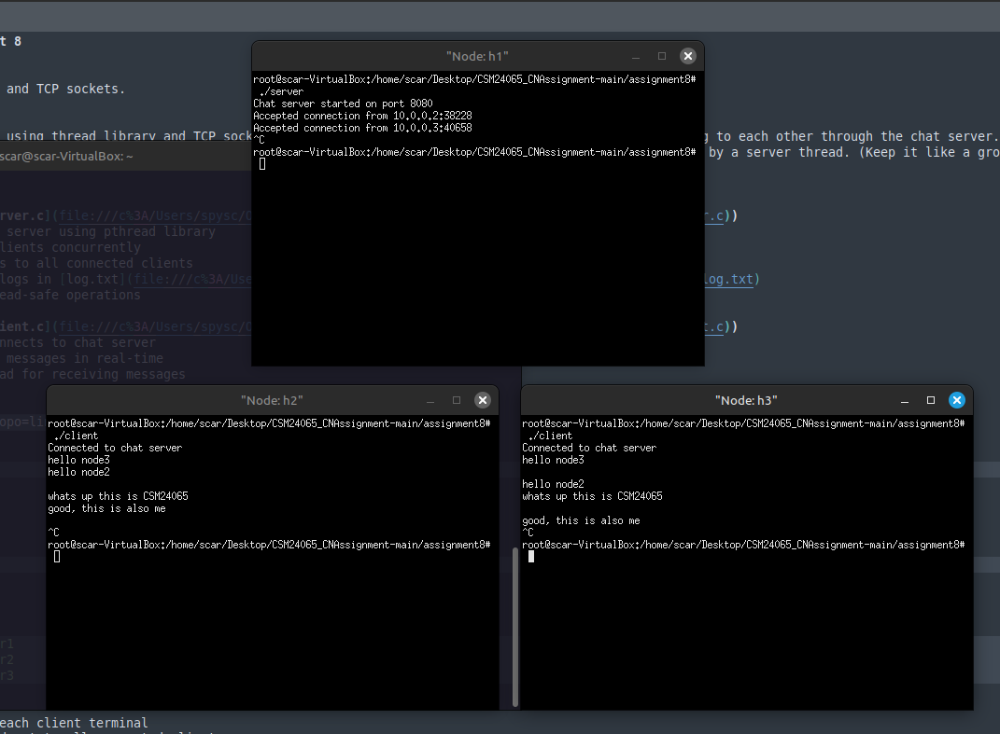

# CN Lab - Assignment 8

## Objective
Using Thread library and TCP sockets.

## Exercise
Write a program in C using thread library and TCP sockets to build a chat server which enable clients communicating to each other through the chat server. Message logs must be maintained in the server in a text file. Each client will see the conversations in real time. Clients must handled by a server thread. (Keep it like a group chatbox)

## Implementation

### Server ([chat_server.c](file:///c%3A/Users/spysc/OneDrive/Desktop/CSM24065_CNAssignment/assignment8/chat_server.c))
- Multi-threaded TCP server using pthread library
- Handles multiple clients concurrently
- Broadcasts messages to all connected clients
- Maintains message logs in [log.txt](file:///c%3A/Users/spysc/OneDrive/Desktop/CSM24065_CNAssignment/assignment6/log.txt)
- Uses mutex for thread-safe operations

### Client ([chat_client.c](file:///c%3A/Users/spysc/OneDrive/Desktop/CSM24065_CNAssignment/assignment8/chat_client.c))
- TCP client that connects to chat server
- Sends and receives messages in real-time
- Uses separate thread for receiving messages

## Compilation
Mininet: sudo mn --topo=linear,3

```bash
gcc chat_server.c -o chat_server -lpthread
gcc chat_client.c -o chat_client -lpthread
```

## Usage
1. Start server:
   ```bash
   ./chat_server
   ```

2. Connect clients:
   ```bash
   ./chat_client user1
   ./chat_client user2
   ./chat_client user3
   ```

3. Type messages in each client terminal
4. Messages are broadcast to all connected clients
5. Conversation log is saved in [log.txt](file:///c%3A/Users/spysc/OneDrive/Desktop/CSM24065_CNAssignment/assignment6/log.txt)

## Learning Outcomes
1. Understanding multi-threading for TCP sockets.

## Output Screenshots



CSM24065